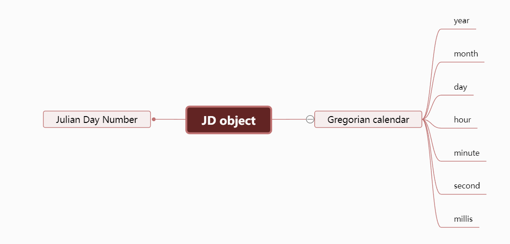

# @lunisolar/julian

## Table of Contents

- [About](#about)
- [Installing](#installing)
- [Import](#import)
- [Usage](#usage)
- [JD Class Api](#api)
- [Others](#others)

## About <a name = "about"></a>

**@lunisolar/julian** is a tool for converting `Julian Day Number` and `Gregorian calendars`

## Installing  <a name = "installing"></a>

```shell
npm install @lunisolar/julian
```

## Import <a name = "import"></a>

**ES Module**:

```typescript
import { JD } from '@lunisolar/julian'
```

**CommonJS**:

```javascript
const { JD } = require('@lunisolar/julian')
```

## Usage <a name = "usage"></a>

The Julian day number is converted to the Gregorian calendar by creating a JD instance



```typescript
import { JD } from '@lunisolar/julian'

// ---- create a JD instance from Julian Day Number
const jd = JD.fromJdn(2460101)

// This will return the local Gregorian calendar time, the following example is based on the East Eighth time zone
const gre = jd.toGre() 
console.log(gre.year) // 2023
console.log(gre.month) // 6
console.log(gre.day) // 5
console.log(gre.hour) // 20
console.log(gre.minute) // 0
console.log(gre.second) // 0

// You can also use the `format` method
console.log(jd2.format('YYYY-MM-DD HH:mm:ss')) // 2023-06-05 20:00:00


// You can switch to UTC mode, the `utc()` method will return a new JD instance
const jd2 = jd.utc() 
// or create a JD instance by `jd2 = JD.fromJdn(2460101, { isUTC: true })`

console.log(jd2.toGre().year) // 2023
console.log(jd2.toGre().hour) // 12

// The year, month, day and hour can be obtained without the `toGre()` method
console.log(jd2.year) // 2023
console.log(jd2.month) // 6
console.log(jd2.day) // 5
console.log(jd2.hour) // 12
console.log(jd2.minute) // 0
console.log(jd2.second) // 0

// You can also use the `format` method
console.log(jd2.format('YYYY-MM-DD HH:mm:ss')) // 2023-06-05 12:00:00


// ---- create a JD instance from Gregorian calendar
const jd3 = JD.fromGre('2023-05-09 12:00:00')

// get the `Julian Day Number`
console.log(jd3.jdn) // 2460073.6666666665

// The `fromGre()` static method argument can also receive a `DateDict` object
const jd4 = JD.fromGre({
  year: 2023,
  month: 5,
  day: 9,
  hour: 12
})

```

## JD Class API  <a name = "api"></a>

### fromGre()

create a JD instance from Gregorian calendar

-- static method --

```typescript
/**
  * Create JD object from the Gregorian calendar
  *
  * @param dateDict Gregorian calendar date
  * @param config config
  * @returns JD Instance
  */
JD.fromGre(dateDict?: Partial<DateDict> | string, config?: Partial<JDConfig>): JD

type DateDict = {
  year: number
  month: number
  day: number
  hour: number
  minute: number
  second: number
  millisecond?: number
}

type JDConfig = {
  isUTC: boolean
  offset: number
}
```

example:

```typescript
const jd = JD.fromGre('2023-05-09', { isUTC: true })
```

### fromJdn()

create a JD instance from **Julian Day Number**

-- static method --

```typescript
/**
 * Create JD object from the Julian Day Number
 *
 * @param jdn Julian Day Number
 * @param config config
 * @returns JD Instance
  */
JD.fromJdn(jdn: number, config?: Partial<JDConfig>): JD

type JDConfig = {
  isUTC: boolean
  offset: number
}
```

example:

```typescript
const jd = JD.fromJdn(2460101)
```

### gre2jdn()

**Gregorian calendar**  convert to **Julian Day Number** without create JD instance

-- static method --

```typescript

/**
  * Gregorian calendar to Julian Day Number
  *
  * @param date  Gregorian calendar date
  * @param isUTC is UTC?
  * @returns Julian Day Number
  */
JD.gre2jdn(date?: Date | Partial<DateDict> | string, isUTC = false): number

type DateDict = {
  year: number
  month: number
  day: number
  hour: number
  minute: number
  second: number
  millisecond?: number
}
```

example:

```typescript
const jdn = JD.gre2jdn('2023-05-09', true)
console.log(jdn) // 2460073.5
```

### jdn2gre()

**Julian Day Number** convert to **Gregorian calendar** without create JD instance

-- static method --

```typescript

/**
  * Gregorian calendar to Julian Day Number
  *
  * @param date  Gregorian calendar date
  * @param isUTC is UTC? defalut `false`
  * @returns Julian Day Number
  */
JD.jdn2gre(jdn: number, isUTC = false): Required<DateDict>

type DateDict = {
  year: number
  month: number
  day: number
  hour: number
  minute: number
  second: number
  millisecond?: number
}
```

example:

```typescript
const gre = JD.jdn2gre('2460073.5', true)
```

### toGre()

Returns the Gregorian `DateDict` object for the current JD instance

```typescript
toGre(): DateDict
```

example:

```typescript
const gre = JD.fromJdn('2460073.5').toGre()
```

### jdn

Get `Julian Day Number`

example:

```typescript
const jd = JD.fromGre('2023-05-09', { isUTC: true })
console.log(jd.jdn) // 2460073.5
```

### clone()

clone a JD instance

example:

```typescript
const jd = JD.fromGre('2023-05-09', { isUTC: true })
const jd2 = jd.clone()
```

### utc()

Change to UTC mode. Returns a new JD instance.

example:

```typescript
const jd = JD.fromGre('2023-05-09')
const jd2 = jd.utc()
```

### local()

Change to local mode. Returns a new JD instance.

example:

```typescript
const jd = JD.fromGre('2023-05-09', { isUTC: true })
const jd2 = jd.local()
```

### isUTC()

Check whether the current instance is in UTC mode. return boolean value.

example:

```typescript
const jd = JD.fromGre('2023-05-09', { isUTC: true })
console.log(jd.isUTC()) // true
```

### year, month, day, hour, minute, second, millisecond

get year, month, day, hour, minute, second or millisecond

example:

```typescript
const jd = JD.fromJdn(2460101, { isUTC: true })

console.log(jd.year) // 2023
console.log(jd.month) // 6
console.log(jd.day) // 5
console.log(jd.hour) // 12
console.log(jd.minute) // 0
console.log(jd.second) // 0
console.log(jd.millisecond) // 0 (Due to the precision of decimal calculations, the calculation of milliseconds is only an approximation )
console.log(jd.dayOfWeek) // 1
```

### timestamp

Get timestamp

example:

```typescript
const jd = JD.fromGre('2023-05-15 16:30', { isUTC: true })

console.log(jd.timestamp) // 1684168200000
```

### toDate()

Get a new Date object instance.

Note that if your year is less than 1900, it is not guaranteed to get the correct Date object.

example:

```typescript
const jd = JD.fromGre('2023-05-15 16:30', { isUTC: true })

const d = jd.toDate()
console.log(d.getFullYear()) // 2023
```

### format()

format time. return string.

```typescript
format(formatStr?: string): string
```

example:

```typescript
const jd = JD.fromJdn(2460101, { isUTC: true })
console.log(jd.fromat('YYYY-MM-DD HH:mm:ss')) // 2023-06-06 12:00:00
```

| Format | Output | Description |
| ---- | ---- | --- |
| YY  |  23 | Two-digit year |
| YYYY | 2023 | Four-digit year|
| M  | 1-12 | The month, beginning at 1  |
| MM | 01-12 | The month, 2-digits |
| D | 1-31 | The day of the month |
| DD | 01-31 | The day of the month, 2-digits |
| H | 0-23 | The hour |
| HH | 00-23 | The hour, 2-digits |
| h | 1-12 | The hour, 12-hour clock |
| hh | 01-12 | The hour, 12-hour clock, 2-digits |
| m | 0-59 | The minute |
| mm | 00-59 | The minute, 2-digits |
| s | 0-59 | The second |
| ss | 00-59 | The second, 2-digits |
| SSS | 000-999 | The millisecond, 3-digits |
| A | AM PM | |
| a | am pm |  |

### add()

Time adds or subtracts, Returns a new JD instance.

```typescript
add(value: number, unit: GreUnit): JD

type GreUnit = 
  | 'millisecond'
  | 'second' 
  | 'minute' 
  | 'hour' 
  | 'day' 
  | 'month' 
  | 'year' 
  | 'ms' 
  | 's' 
  | 'm' 
  | 'h' 
  | 'd'
  | 'M' 
  | 'y'
```

example:

```typescript
const jd = JD.fromGre('2023-05-09 12:00:00', { isUTC: true })

// add 1 day
const jd2 = jd.add(1, 'day')
console.log(jd2.fromat('YYYY-MM-DD')) // 2023-05-10

// subtract 1 day
console.log(jd.add(-1, 'day').fromat('YYYY-MM-DD')) // 2023-05-08

// add 1 month
console.log(jd.add(1, 'month').fromat('YYYY-MM-DD')) // 2023-06-09
```

| Unit | Shorthand | Description |
| ----| --- | --- |
| day | d | Day |
| month | M | Month |
| year | y | Year |
| hour | h | Hour |
| minute | m | Minute |
| second | s | Second |
| millisecond | ms | Millisecond |

## Others <a name = "others"></a>

### J2000

Get the `Julian Day Number` of January 1, 2000.

```typescript
import { J2000 } from '@lunisolar/julian'

console.log(J2000) // 2451545
```

### Date2DateDict()

Convert Date object to DateDict object.

```typescript
import { date2DateDict } from '@lunisolar/julian'

const date = new Date(2023, 5, 9)

const dd = date2DateDict(date)

console.log(dd.year) // 2023
console.log(dd.month) // 5
console.log(dd.day) // 9
console.log(dd.hour) // 0
console.log(dd.minute) // 0
console.log(dd.second) // 0
```
